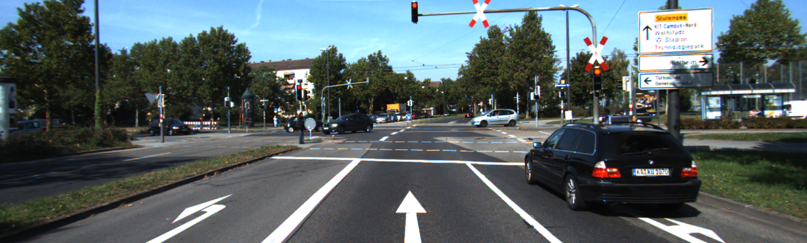

# CarND-Semantic-Segmentation-P2
Udacity Self-Driving Car Nanodegree - Semantic Segmentation Project

# Overview

The object of this project is to label the pixels of a road image using the Fully Convolutional Network (FCN) described in the [Fully Convolutional Networks for Semantic Segmentation](https://people.eecs.berkeley.edu/~jonlong/long_shelhamer_fcn.pdf) by Jonathan Long, Even Shelhamer, and Trevor Darrel. The project is based on the starting project provided by Udacity in [this repo](https://github.com/udacity/CarND-Semantic-Segmentation).

# Prerequisites

Based on Udacity's start project the following frameworks and packages should be installed to execute the code:

- [Python 3](https://www.python.org/)
- [TensorFlow](https://www.tensorflow.org/) (>= V1.2)
- [NumPy](http://www.numpy.org/)
- [SciPy](https://www.scipy.org/)
- [Seaborn]
- [Matplotlib]

For this project a GPU with VRAM greater then 4GB is required. I've used a Nvidia GEforce GTC 1080Ti for build an d train the model.
As an alternative GPU cloud computing services can be used.

The dataset used in this project is the [Kitti Road dataset](http://www.cvlibs.net/datasets/kitti/eval_road.php). It can be download from [here](http://www.cvlibs.net/download.php?file=data_road.zip) 

# Code description

Most of the code is inside [`main.py`](./main.py) [`run`](./main.py#L178) function. The code downloads a pre-trained VGG16 model and extracts the input, keep probability, layer 3, layer 4 and layer 7 (method [`load_vgg`](./main.py#L20) from line 20 to line 44). These layers are used as a "pretrained feature extractor" which is connected in the [`layers`](./main.py#L49) function to subsequent convolution, deconvolution and skipping layers:

- One convolutional layer with kernel 1 from VGG's layer 7 ([line 62](./main.py#L62)).
- One deconvolutional layer with kernel 4 and stride 2 from the first convolutional layer ([line 67](./main.py#L67)).
- One convolutional layer with kernel 1 from VGG's layer 4 ([line 74](./main.py#L74)).
- The two layers above are added to create the first skip layer ([line 79](./main.py#L79)).
- One deconvolutional layer with kernel 4 and stride 2 from the first ship layer ([line 81](./main.py#L81)).
- One convolutional layer with kernel 1 from VGG's layer 3 ([line 87](./main.py#L87)).
- The two layers above are added to create the second skip layer ([line 92](./main.py#L92)).
- One deconvolutional layer with kernel 16 and stride 8 from the second skip layer ([line 94](./main.py#L94)).

The convolutional and deconvolutional layer use a random-normal kernel initializer with standard deviation 0.01 and a L2 kernel regularizer with L2 0.001 to address over-fitting and feature selection.

Once the network structure is defined, the optimizer and the softmax_cross_entropy_with_logits is defined in the [`optimize`](./main.py#L178)function using [Adam optimizer](https://en.wikipedia.org/wiki/Stochastic_gradient_descent#Adam).

The network is trained using the [`train_nn`](./main.py#L140) (from line 140 to line 174) using keep probability 0.5 and learning rate 0.00001. To facilitate the loss value analysis, later on, every batch loss values are stored in a python list.
# Training

The dataset used for training the network was

Example of an Input/Groundtruth training pair:

##### Input image:

##### Ground truth image:

![png] (images/umm_road_000005.png)

The network training was done for 50 and 75 epochs. The following graphs show the loss after each epoch:

![cross entropy loss] (images/aug_data_50eps.png)

# Prediction 

