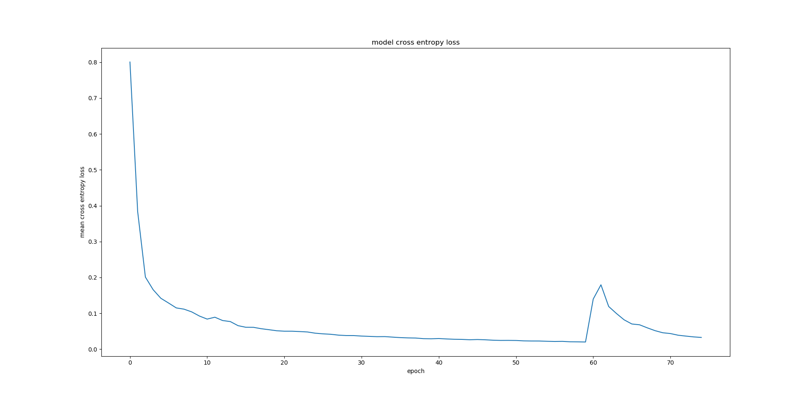

# CarND-Advanced Deep Learning-P12
Udacity Self-Driving Car Nanodegree - Semantic Segmentation Project

# Overview

The object of this project is to label the pixels of a road image using the Fully Convolutional Network (FCN) described in the [Fully Convolutional Networks for Semantic Segmentation](https://people.eecs.berkeley.edu/~jonlong/long_shelhamer_fcn.pdf) by Jonathan Long, Even Shelhamer, and Trevor Darrel. The project is based on the starting project provided by Udacity in [this repo](https://github.com/udacity/CarND-Semantic-Segmentation).

# Prerequisites

Based on Udacity's start project the following frameworks and packages should be installed to execute the code:

- [Python 3](https://www.python.org/)
- [TensorFlow](https://www.tensorflow.org/) (>= V1.2)
- [NumPy](http://www.numpy.org/)
- [SciPy](https://www.scipy.org/)
- [Seaborn]
- [Matplotlib]

For this project a GPU with VRAM greater then 4GB is required. I've used a Nvidia GEforce GTC 1080Ti for build an d train the model.
As an alternative GPU cloud computing services can be used.

The dataset used in this project is the [Kitti Road dataset](http://www.cvlibs.net/datasets/kitti/eval_road.php). It can be download from [here](http://www.cvlibs.net/download.php?file=data_road.zip) 

# Code description

Most of the code is inside [`main.py`](./main.py) [`run`](./main.py#L178) function. The code downloads a pre-trained VGG16 model and extracts the input, keep probability, layer 3, layer 4 and layer 7 (method [`load_vgg`](./main.py#L20) from line 20 to line 44). These layers are used as a "pretrained feature extractor" which is connected in the [`layers`](./main.py#L49) function to subsequent convolution, deconvolution and skipping layers:

- One convolutional layer with kernel 1 from VGG's layer 7 ([line 62](./main.py#L62)).
- One deconvolutional layer with kernel 4 and stride 2 from the first convolutional layer ([line 67](./main.py#L67)).
- One convolutional layer with kernel 1 from VGG's layer 4 ([line 74](./main.py#L74)).
- The two layers above are added to create the first skip layer ([line 79](./main.py#L79)).
- One deconvolutional layer with kernel 4 and stride 2 from the first ship layer ([line 81](./main.py#L81)).
- One convolutional layer with kernel 1 from VGG's layer 3 ([line 87](./main.py#L87)).
- The two layers above are added to create the second skip layer ([line 92](./main.py#L92)).
- One deconvolutional layer with kernel 16 and stride 8 from the second skip layer ([line 94](./main.py#L94)).

The convolutional and deconvolutional layer use a random-normal kernel initializer with standard deviation 0.01 and a L2 kernel regularizer with L2 0.001 to address over-fitting and feature selection.

Once the network structure is defined, the optimizer and the softmax_cross_entropy_with_logits is defined in the [`optimize`](./main.py#L178)function using [Adam optimizer](https://en.wikipedia.org/wiki/Stochastic_gradient_descent#Adam).

The network is trained using the [`train_nn`](./main.py#L140) (from line 140 to line 174) using keep probability 0.5 and learning rate 0.00001. To facilitate the loss value analysis, later on, every batch loss values are stored in a python list.
# Training

After running 75 epochs I found a loss anomalie after training the 60th epoch. This might occur if specific training data contain data that are either mislabeled or very uncommon for this data set.

Due to that fact, I decided to recude the amount of epochs to 57 which leads to a final loss(mean) of 0.02334. The standard deviation for all losses in this epoch is 0.0037.

| ep.|  mean_loss           |  std_loss             | 
|----|----------------------|-----------------------| 
| 0  | 0.757626132718448    | 0.2621333103347382    | 
| 1  | 0.3831896185874939   | 0.07214048808171054   | 
| 2  | 0.23859594402642087  | 0.026466078991430803  | 
| 3  | 0.1891981286221537   | 0.022813462021086604  | 
| 4  | 0.15737150378268341  | 0.025712487125836292  | 
| 5  | 0.14074750784142265  | 0.019855265910437667  | 
| 6  | 0.13328263446174818  | 0.021122767571356754  | 
| 7  | 0.11596262532061544  | 0.014981631899539617  | 
| 8  | 0.10781382049979835  | 0.015472813021729334  | 
| 9  | 0.10288809162789378  | 0.015308273234845517  | 
| 10 | 0.09603397316973784  | 0.016411046441022658  | 
| 11 | 0.08673106917533381  | 0.015498441395315043  | 
| 12 | 0.0881039771283495   | 0.015351639639494583  | 
| 13 | 0.08024555457563236  | 0.01317726923086457   | 
| 14 | 0.07317621350802224  | 0.009533626997358434  | 
| 15 | 0.0796846612517176   | 0.017815008383898562  | 
| 16 | 0.07060634190666265  | 0.011793679200824466  | 
| 17 | 0.06262404381715019  | 0.00987944288592727   | 
| 18 | 0.0602867519804116   | 0.009064383813915462  | 
| 19 | 0.05702835976563651  | 0.009023141803717319  | 
| 20 | 0.056128306121661746 | 0.00830621872446695   | 
| 21 | 0.051251588325048315 | 0.00790790424176557   | 
| 22 | 0.049751636540067604 | 0.007676684256867391  | 
| 23 | 0.04729199878357608  | 0.00824493675682171   | 
| 24 | 0.045728305418943536 | 0.005120077648751221  | 
| 25 | 0.04417773066409703  | 0.0066096066054667085 | 
| 26 | 0.04313388826518223  | 0.0074639190775977245 | 
| 27 | 0.09011856633527525  | 0.0382887820998112    | 
| 28 | 0.07907699254052393  | 0.015545893525633559  | 
| 29 | 0.05773562372758471  | 0.009658077553688277  | 
| 30 | 0.048480830315885876 | 0.007102226648861653  | 
| 31 | 0.044692497957369376 | 0.007716678772644292  | 
| 32 | 0.04208031360959184  | 0.006556003236782038  | 
| 33 | 0.03966949070835936  | 0.005205969887007406  | 
| 34 | 0.03761174054495219  | 0.005090576987779448  | 
| 35 | 0.03661944383177264  | 0.005840223370348693  | 
| 36 | 0.036454501401247646 | 0.005583267960754267  | 
| 37 | 0.03477964254802671  | 0.005853885512710071  | 
| 38 | 0.03404846543381954  | 0.005476197244222165  | 
| 39 | 0.03296988804278703  | 0.004742226339073874  | 
| 40 | 0.033468981048670306 | 0.0063796020534550735 | 
| 41 | 0.03304029583674053  | 0.0033649660607978434 | 
| 42 | 0.03060384775544035  | 0.004802472723606328  | 
| 43 | 0.02950677198582682  | 0.00435046646997735   | 
| 44 | 0.029615157315957135 | 0.004086947209054838  | 
| 45 | 0.02912153984452116  | 0.005340985028164137  | 
| 46 | 0.028704924765845824 | 0.004105165419528254  | 
| 47 | 0.028108343674704946 | 0.0038296975668575674 | 
| 48 | 0.027248969751185383 | 0.0038994760867918604 | 
| 49 | 0.027334295405909932 | 0.0053722926516606455 | 
| 50 | 0.025939978402236413 | 0.0037832731803667963 | 
| 51 | 0.025757995980053114 | 0.00407954714881273   | 
| 52 | 0.025663605024074686 | 0.0036253272486651573 | 
| 53 | 0.024658221879909778 | 0.003119187889140136  | 
| 54 | 0.023920278546625172 | 0.0035806748935509206 | 
| 55 | 0.023522066402024235 | 0.004076111138302887  | 
| 56 | 0.02334429824660564  | 0.0037011082087828736 | 

The dataset I've used to train the network was

Example of an Input/Groundtruth training pair:

##### Input image:

##### Ground truth image:

The network training was done for 50 and 75 epochs. The following graph shows the loss for each epoch:

![cross entropy loss] (images/aug_data_50eps.png)

# Prediction 

